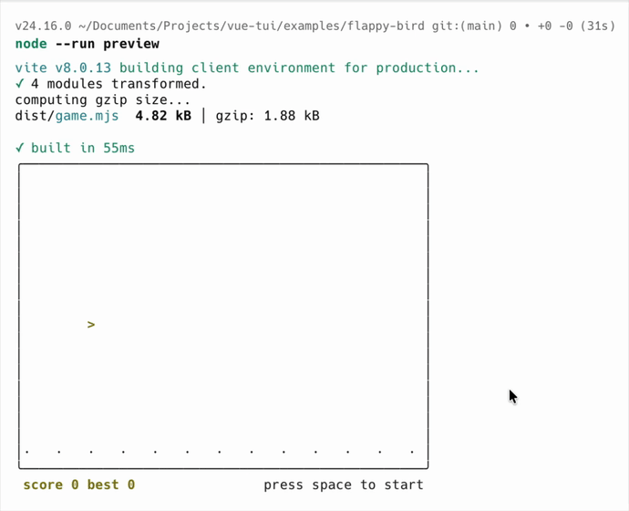

# vue-tui

> **Public beta** — the `@vue-tui/runtime` API is stabilizing toward 1.0; dev-mode HMR is still experimental. Bug reports welcome.

The Vue framework for terminal UIs.
Build with components, develop with HMR, test with confidence.

<p align="center">
  <a href="https://npmx.dev/@vue-tui/runtime"><code>@vue-tui/runtime</code></a> · <a href="https://npmx.dev/@vue-tui/components"><code>@vue-tui/components</code></a> · <a href="https://npmx.dev/@vue-tui/vite"><code>@vue-tui/vite</code></a> · <a href="https://npmx.dev/@vue-tui/testing"><code>@vue-tui/testing</code></a>
</p>

- **Vue SFC & JSX** — write terminal interfaces with `<template>`, TSX, or both
- **Flexbox layout** — powered by Yoga, the same engine behind React Native
- **Dev toolkit** _(experimental)_ — **HMR** in the terminal via the `@vue-tui/vite` plugin (`npm run dev`)
- **Input & focus** — keyboard handling, focus management, Tab navigation, Kitty keyboard protocol
- **Testing harness** — out-of-the-box component-level terminal testing — render, simulate input, assert frames

<p align="center">
  <a href="./examples/flappy-bird"><em>Flappy Bird</em></a> — one of the <a href="#examples">examples</a> included in the repo
  <br /><br />
  <a href="./examples/flappy-bird">
    
  </a>
</p>

## Quick Start

There are two ways to use vue-tui — scaffold a full project, or drop the runtime into an existing one.

### 1. Scaffold a project (recommended)

A ready-to-develop setup: Vue SFCs and a terminal HMR dev server via the `@vue-tui/vite` plugin.

```bash
npx tiged vuejs-ai/vue-tui-starter/vite my-app
cd my-app
npm install
npm run dev      # in-process terminal dev server with HMR
```

Edit `src/app.vue` and watch the terminal update instantly.

### 2. Use the runtime standalone

`@vue-tui/runtime` is a standalone Vue renderer, independent of the `@vue-tui/vite` plugin. Author components as SFCs and mount them with `createApp`, using your own build:

```vue
<!-- app.vue -->
<script setup lang="ts">
import { shallowRef } from "vue";
import { Box, Text, useInput } from "@vue-tui/runtime";

const count = shallowRef(0);

useInput((input) => {
  // "+" is Shift+"=" on most keyboards, so accept the bare "=" too.
  if (input === "+" || input === "=") count.value++;
  if (input === "-") count.value--;
});
</script>

<template>
  <Box>
    <Text>Count: </Text>
    <Text bold color="green">{{ count }}</Text>
    <Text dimColor> (+/= and - to change)</Text>
  </Box>
</template>
```

```ts
// main.ts
import { createApp } from "@vue-tui/runtime";
import App from "./app.vue";

createApp(App).mount();
```

- Compile the SFCs with [`@vitejs/plugin-vue`](https://www.npmjs.com/package/@vitejs/plugin-vue), or use JSX with [`@vitejs/plugin-vue-jsx`](https://www.npmjs.com/package/@vitejs/plugin-vue-jsx).
- If you want hot-reload while developing, use the `@vue-tui/vite` plugin (that's what option 1 sets up for you).

## Table of Contents

- [Quick Start](#quick-start)
- [Packages](#packages)
- [Examples](#examples)
- [Components](#components)
- [High-level Components](#high-level-components)
- [Composables (Hooks)](#composables-hooks)
- [Testing](#testing)
- [Development](#development)
- [Contributing](#contributing)
- [Credits](#credits)
- [License](#license)

## Packages

| Package                                                                    | Description                                                                                                                                                                                                   |
| -------------------------------------------------------------------------- | ------------------------------------------------------------------------------------------------------------------------------------------------------------------------------------------------------------- |
| [`@vue-tui/runtime`](https://www.npmjs.com/package/@vue-tui/runtime)       | The core framework — Vue 3 renderer for the terminal with components (`Box`, `Text`, `Static`, etc.), composables (`useInput`, `useFocus`, `useApp`, etc.), and yoga-based flexbox layout. _API stabilizing._ |
| [`@vue-tui/vite`](https://www.npmjs.com/package/@vue-tui/vite)             | Vite plugin — add `vueTui()` to `vite.config.ts` for an in-process terminal dev server with HMR (`npm run dev`) plus a production build (`vite build`). _Experimental; may change._                           |
| [`@vue-tui/testing`](https://www.npmjs.com/package/@vue-tui/testing)       | Test harness — render in an isolated fake terminal, simulate input, assert output frame by frame                                                                                                              |
| [`@vue-tui/components`](https://www.npmjs.com/package/@vue-tui/components) | High-level components built on the runtime primitives — currently `<Spinner>` (animated loading), with more to come.                                                                                          |

## Examples

| Example                                       | Description                                                 |
| --------------------------------------------- | ----------------------------------------------------------- |
| [`basic-template`](./examples/basic-template) | Vue SFC with `<template>` syntax                            |
| [`basic-jsx`](./examples/basic-jsx)           | Same app in TSX                                             |
| [`coding-agent`](./examples/coding-agent)     | AI coding agent with LLM streaming and interactive UI       |
| [`flappy-bird`](./examples/flappy-bird)       | Physics-based terminal game with reactive state and borders |

## Components

| Component                           | Description                                                                                    |
| ----------------------------------- | ---------------------------------------------------------------------------------------------- |
| [`<Box>`](./packages/runtime)       | Flexbox container — direction, wrap, align, justify, gap, padding, margin, borders, background |
| [`<Text>`](./packages/runtime)      | Styled text — color, bold, italic, underline, strikethrough, dimColor, wrap/truncate modes     |
| [`<Spacer>`](./packages/runtime)    | Expands to fill available space (`flex-grow: 1`)                                               |
| [`<Newline>`](./packages/runtime)   | Inserts line breaks (configurable `count`)                                                     |
| [`<Static>`](./packages/runtime)    | Renders a list of items once, above the redrawn region                                         |
| [`<Transform>`](./packages/runtime) | Applies a string transform function to each rendered line                                      |

## High-level Components

The [`@vue-tui/components`](./packages/components) package adds higher-level components composed from the runtime primitives — published separately from the core.

| Component                            | Description                                                                                |
| ------------------------------------ | ------------------------------------------------------------------------------------------ |
| [`<Spinner>`](./packages/components) | Animated loading spinner — built-in `dots`/`line` presets or custom frames, optional label |

## Composables (Hooks)

| Composable                   | Description                                                                                                                                                  |
| ---------------------------- | ------------------------------------------------------------------------------------------------------------------------------------------------------------ |
| `useInput(handler, opts?)`   | Handle keyboard input — receives `(input, key)` with modifier and arrow key detection                                                                        |
| `usePaste(handler, opts?)`   | Handle bracketed paste — receives the pasted `text` as a single event                                                                                        |
| `useFocus(opts?)`            | Component-level focus — returns `{ isFocused, focus }`                                                                                                       |
| `useFocusManager()`          | App-level focus control — `focusNext()`, `focusPrevious()`, `focus(id)`                                                                                      |
| `useApp()`                   | App lifecycle — `{ exit(error?), waitUntilRenderFlush() }`                                                                                                   |
| `useWindowSize()`            | Reactive terminal dimensions — `{ columns, rows }`                                                                                                           |
| `useStdin()`                 | Access stdin stream and raw mode control                                                                                                                     |
| `useStdout()`                | Write directly to stdout                                                                                                                                     |
| `useStderr()`                | Write directly to stderr                                                                                                                                     |
| `useBoxMetrics(ref)`         | Measure a `<Box>` via a template ref — reactive `{ width, height, left, top, hasMeasured }` (or `measureElement(el)` for a one-off `{ width, height }` read) |
| `useCursor()`                | Control the terminal cursor — `setCursorPosition(pos)` in output coordinates                                                                                 |
| `useIsScreenReaderEnabled()` | Whether a screen reader is active — returns a boolean for adapting accessible output                                                                         |
| `useAnimation(opts?)`        | Frame-based animation driver — reactive `{ frame, time, delta }` + `reset()`                                                                                 |

## Testing

The `@vue-tui/testing` package renders components in an isolated environment and lets you simulate input and assert visual output:

```bash
npm install -D @vue-tui/testing
```

```tsx
import { defineComponent, shallowRef } from "vue";
import { expect, test } from "vitest";
import { render } from "@vue-tui/testing";
import { Box, Text, useInput } from "@vue-tui/runtime";

test("counter responds to + and - keys", async () => {
  const Counter = defineComponent(() => {
    const count = shallowRef(0);
    useInput((input) => {
      if (input === "+") count.value++;
      if (input === "-") count.value--;
    });
    return () => (
      <Box>
        <Text>Count: {count.value}</Text>
      </Box>
    );
  });

  const { lastFrame, stdin } = await render(Counter);
  expect(lastFrame()).toContain("Count: 0");

  await stdin.write("+");
  expect(lastFrame()).toContain("Count: 1");

  await stdin.write("-");
  expect(lastFrame()).toContain("Count: 0");
});
```

## Development

Requires [pnpm](https://pnpm.io/) and Node.js 22+.

```bash
pnpm install          # install dependencies
vp run ready          # lint, typecheck, test, and build (the full check)
vp run -r test        # run tests across all packages
vp run -r build       # build all packages
```

To run an example with terminal HMR, use vanilla `vite@8` (the recommended setup): `cd examples/basic-template && npm run dev`. See that example's `README.md` for the in-monorepo caveat.

## Contributing

Contributions welcome! vue-tui is evolving fast — please open an issue before starting large changes. If you use AI tools, disclose it in your PR and make sure you've reviewed and tested everything before submitting.

## Credits

vue-tui is built on the ideas pioneered by [Ink](https://github.com/vadimdemedes/ink) — component model, yoga-based layout, focus system, and rendering pipeline — adapted to Vue's philosophy. Thanks to [Vadim Demedes](https://github.com/vadimdemedes), [Sindre Sorhus](https://github.com/sindresorhus), and the [Ink contributors](https://github.com/vadimdemedes/ink/graphs/contributors).

## License

MIT
