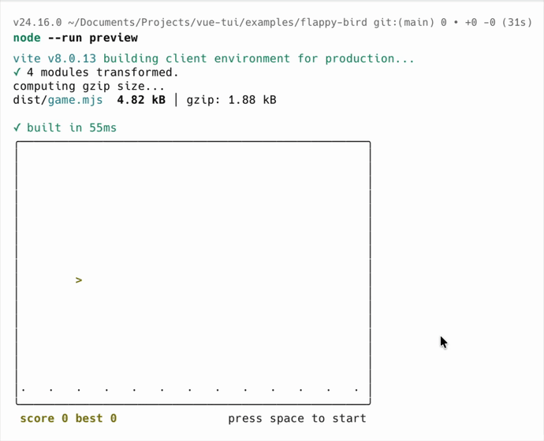

# vue-tui

> **Public beta** — the `@vue-tui/runtime` API is stabilizing toward 1.0; dev-mode HMR is still experimental. Bug reports welcome.

vue-tui is a Vue-native application framework for interactive terminal UIs.
Build with components, develop with HMR, test with confidence.

<p align="center">
  <a href="https://npmx.dev/@vue-tui/runtime"></a>
  <a href="https://npmx.dev/@vue-tui/use"></a>
  <a href="https://npmx.dev/@vue-tui/components"></a>
  <a href="https://npmx.dev/@vue-tui/vite"></a>
  <a href="https://npmx.dev/@vue-tui/testing"></a>
</p>

- **Vue SFC & JSX** — write terminal interfaces with `<template>`, TSX, or both
- **Flexbox layout** — powered by Yoga, the same engine behind React Native
- **Dev toolkit** _(experimental)_ — **HMR** in the terminal via the `@vue-tui/vite` plugin (`pnpm dev`)
- **Input and focus primitives** — normalized text, paste, and key facts with managed terminal ownership, plus explicit unique focus handles that compose with input subscriptions
- **Small public foundation** — renderer-owned facts stay public only when application code cannot derive them safely
- **Testing harness** — out-of-the-box component-level terminal testing — render, simulate input, assert frames

<p align="center">
  <a href="./examples/flappy-bird"><em>Flappy Bird</em></a> — one of the <a href="#examples">examples</a> included in the repo
  <br /><br />
  <a href="./examples/flappy-bird">
    
  </a>
</p>

## Quick Start

There are two ways to use vue-tui — scaffold a full project, or drop the runtime into an existing one.

### 1. Scaffold a standalone TUI application (recommended)

Use the scaffold when the project is a TUI application that owns its Node process and terminal. One Vite config compiles the Vue SFCs, runs the development server with terminal HMR, and builds a self-contained Node bundle.

```bash
pnpm dlx tiged vuejs-ai/vue-tui/templates/vite my-app
cd my-app
pnpm install
pnpm dev      # in-process terminal dev server with HMR
pnpm build    # Vite builds dist/main.mjs
pnpm preview  # build, then run the production bundle
```

Edit `src/app.vue` and watch the terminal update instantly.

### 2. Embed the standalone runtime

Use this path when vue-tui is one part of an existing Node CLI or application. `@vue-tui/runtime` is a standalone Vue renderer: keep the host application's Vue compiler, build, and process lifecycle. The `@vue-tui/vite` development plugin is not required.

```vue
<!-- app.vue -->
<script setup lang="ts">
import { shallowRef } from "vue";
import { Box, Text, useInput } from "@vue-tui/runtime";

const count = shallowRef(0);

useInput((event) => {
  if (event.type === "key") {
    if (event.key.name === "up") {
      count.value++;
    } else if (event.key.name === "down") {
      count.value--;
    }
  }
});
</script>

<template>
  <Box>
    <Text>Count: </Text>
    <Text bold color="green">{{ count }}</Text>
    <Text dimColor> (↑/↓ to change)</Text>
  </Box>
</template>
```

```ts
// main.ts
import { createApp } from "@vue-tui/runtime";
import App from "./app.vue";

createApp(App).mount({ exitOnCtrlC: true });
```

## Table of Contents

- [Quick Start](#quick-start)
- [Packages](#packages)
- [Examples](#examples)
- [`@vue-tui/runtime`](#vue-tuiruntime)
- [`@vue-tui/use`](#vue-tuiuse)
- [`@vue-tui/components`](#vue-tuicomponents)
- [`@vue-tui/testing`](#vue-tuitesting)
- [Development](#development)
- [Contributing](#contributing)
- [Credits](#credits)
- [License](#license)

## Packages

| Package                                                                    | Description                                                                                                                                                                                                                                                                                |
| -------------------------------------------------------------------------- | ------------------------------------------------------------------------------------------------------------------------------------------------------------------------------------------------------------------------------------------------------------------------------------------ |
| [`@vue-tui/runtime`](https://www.npmjs.com/package/@vue-tui/runtime)       | The core framework — Vue 3 renderer for the terminal with common components (`Box`, `Text`, etc.), an explicit Inline-history subpath, narrow public layout and Box facts, normalized input, explicit unique focus ownership, lifecycle, and yoga-based flexbox layout. _API stabilizing._ |
| [`@vue-tui/use`](https://www.npmjs.com/package/@vue-tui/use)               | Reusable public-Runtime-only behavior — lifecycle-scoped input as a function-ref composable or renderless component.                                                                                                                                                                       |
| [`@vue-tui/vite`](https://www.npmjs.com/package/@vue-tui/vite)             | Development-only Vite connector — add `vueTui()` for an in-process terminal dev server with HMR. Standalone apps use their own Vite build config; embedded Runtime apps keep their host build and do not need this plugin. _Experimental; may change._                                     |
| [`@vue-tui/testing`](https://www.npmjs.com/package/@vue-tui/testing)       | Deterministic test host — model terminal or stream conditions, inspect content commits, and assert the terminal-emulated screen                                                                                                                                                            |
| [`@vue-tui/components`](https://www.npmjs.com/package/@vue-tui/components) | High-level components built on the runtime primitives — `<ScrollBox>`, `<Spinner>`, `<Table>`, `<Newline>`, and `<Spacer>`.                                                                                                                                                                |

## Examples

| Example                                       | Description                                                 |
| --------------------------------------------- | ----------------------------------------------------------- |
| [`basic-template`](./examples/basic-template) | Vue SFC with `<template>` syntax                            |
| [`basic-jsx`](./examples/basic-jsx)           | Same app in TSX                                             |
| [`coding-agent`](./examples/coding-agent)     | AI coding agent with LLM streaming and interactive UI       |
| [`flappy-bird`](./examples/flappy-bird)       | Physics-based terminal game with reactive state and borders |
| [`scroll-box`](./examples/scroll-box)         | Bounded viewport with app-controlled scrolling              |

## `@vue-tui/runtime`

The core renderer: the terminal primitives and the composables that read
renderer-owned facts. [Package guide](./packages/runtime).

### Components

| Component                                                  | Import from                   | Description                                                                           |
| ---------------------------------------------------------- | ----------------------------- | ------------------------------------------------------------------------------------- |
| [`<Box>`](./packages/runtime/src/components/box.vue)       | `@vue-tui/runtime`            | Layout container — flex, size, spacing, border, background, clipping, and `v-show`    |
| [`<Text>`](./packages/runtime/src/components/text.vue)     | `@vue-tui/runtime`            | Text — foreground/background color, six modifiers, wrapping, truncation, and `v-show` |
| [`<Static>`](./packages/runtime/src/components/static.vue) | **`@vue-tui/runtime/inline`** | Commits a mounted subtree to Inline terminal history                                  |

`Box` and `Text` have closed prop surfaces: unknown props, misspellings, browser attributes, and listeners such as `@click` are rejected at runtime instead of silently ignored. The full prop tables are in the [Runtime guide](./packages/runtime/README.md#components).

`v-show` belongs to the visual host layer rather than to a component allowlist. Vue forwards it through any chain of components whose current effective root is one `Box` or `Text`, so ordinary custom single-root components and the first-party `Newline`, `Spacer`, `Spinner`, `ScrollBox`, and non-empty `Table` inherit it without dedicated support code. An empty `Table` with no explicit columns renders no host node or layout space. Fragment and text roots keep Vue's development warning and ineffective behavior, Comment roots are silently ineffective, and `Static` remains the explicit history-boundary exception.

`Static` is the only export on that subpath, and it is deliberately absent from the package root. It has no collection API — use ordinary Vue iteration with stable keys. Each instance commits its output once and then releases its subtree; effective Fullscreen rejects `Static`.

```vue
<script setup lang="ts">
import { Static } from "@vue-tui/runtime/inline";
</script>

<template>
  <Static v-for="entry in completedEntries" :key="entry.id">
    <CompletedEntry :entry="entry" />
  </Static>
</template>
```

### Composables

Each one must be called inside a mounted render tree.

| Composable                                                                    | Returns                                     | Description                                                                    |
| ----------------------------------------------------------------------------- | ------------------------------------------- | ------------------------------------------------------------------------------ |
| [`useInput(handler, opts?)`](./packages/runtime/src/composables/useInput.ts)  | —                                           | Normalized text, paste, and key events; `opts.isActive` gates the subscription |
| [`useFocus(target?)`](./packages/runtime/src/composables/useFocus.ts)         | `{ isFocused, focus, blur }`                | One explicit focus identity, optionally bound to a rendered component          |
| [`useApp()`](./packages/runtime/src/composables/useApp.ts)                    | `{ exit }`                                  | Request normal or error exit from inside the tree                              |
| [`useLayoutSize()`](./packages/runtime/src/composables/use-layout-size.ts)    | `{ width, height }`                         | Readonly reactive root-layout size; `height` may be `Infinity`                 |
| [`useStdin()`](./packages/runtime/src/composables/useStdin.ts)                | `{ stdin, isRawModeSupported, setRawMode }` | Mounted stdin plus an independently owned raw-mode hold                        |
| [`useBoxMetrics(ref)`](./packages/runtime/src/composables/use-box-metrics.ts) | `{ width, height, left, top, hasMeasured }` | Parent-relative metrics for one directly referenced `<Box>`                    |

`useInput()` delivers one frozen event per input:

| `event.type` | Payload                                                                            |
| ------------ | ---------------------------------------------------------------------------------- |
| `"text"`     | Non-empty `text`, plus a nested `key` when the terminal supplied reliable identity |
| `"key"`      | A required nested `key` and no text                                                |
| `"paste"`    | One complete payload, possibly empty, and no key                                   |

A `key` carries exactly one normalized `name` or one logical `character`, plus `shift`, `alt`, `ctrl`, `meta`, `super`, and `hyper` booleans.

Every active subscription receives every event and handler return values are ignored, so nothing consumes input or steers routing. Focus composes directly as `useInput(handler, { isActive: focus.isFocused })`. See the [Runtime guide](./packages/runtime/README.md#composables) for ownership and lifecycle rules.

`useApp()` intentionally exposes only `exit()`; the coordination barriers `waitUntilExit()` and `waitUntilRenderFlush()` belong to the app owner returned by `createApp()`. Component failures stay Vue failures — Runtime preserves your `onErrorCaptured()` and `app.config.errorHandler` policy. See [App Lifecycle](./packages/runtime/README.md#app-lifecycle).

## `@vue-tui/use`

Reusable behavior composed only from public Runtime APIs. [Package guide](./packages/use).

### Composables

| Composable                                                                                                  | Returns     | Description                                                                                           |
| ----------------------------------------------------------------------------------------------------------- | ----------- | ----------------------------------------------------------------------------------------------------- |
| [`useInputWhileMounted(handler, opts?)`](./packages/use/src/input-while-mounted/use-input-while-mounted.ts) | `targetRef` | Global input, optionally filtered by `opts.type`, while one directly referenced vnode remains mounted |

### Components

| Component                                                                                            | Import from               | Description                                                                                        |
| ---------------------------------------------------------------------------------------------------- | ------------------------- | -------------------------------------------------------------------------------------------------- |
| [`<UseInputWhileMounted type?>`](./packages/use/src/input-while-mounted/use-input-while-mounted.vue) | `@vue-tui/use/components` | Emits global input, optionally filtered by `type`, while mounted and renders only its default slot |

Both forms retain `useInput()`'s broadcast semantics. A literal `type` narrows the handler or emitted event to the selected `text`, `key`, or `paste` member. The bound ref is a lifecycle signal rather than a focus or routing target; `v-show` remains mounted and active.

## `@vue-tui/components`

Higher-level components composed only from the primitives above, published
separately so the core stays small. [Package guide](./packages/components).

| Component                                                            | Description                                                                            |
| -------------------------------------------------------------------- | -------------------------------------------------------------------------------------- |
| [`<ScrollBox>`](./packages/components/src/scroll-box/scroll-box.vue) | Bounded sticky-bottom viewport; the app drives scrolling through its imperative handle |
| [`<Spinner>`](./packages/components/src/spinner/spinner.vue)         | Animated loading spinner — `dots` / `line` presets or custom frames, optional label    |
| [`<Table>`](./packages/components/src/table/table.vue)               | Non-interactive, terminal-width-aware bordered table for typed object rows             |
| [`<Newline>`](./packages/components/src/newline/newline.vue)         | Emits `count` newline characters inside a `<Text>`                                     |
| [`<Spacer>`](./packages/components/src/spacer/spacer.vue)            | A growing `Box` that fills the free main-axis space                                    |

## `@vue-tui/testing`

Renders against a finite modeled host, keeping renderer content commits (`frames`, `lastFrame()`) separate from the terminal-emulated result (`screen()`) so a test asserts the level it actually means.

```bash
npm install -D @vue-tui/testing
```

```tsx
import { defineComponent, shallowRef } from "vue";
import { expect, test } from "vitest";
import { render } from "@vue-tui/testing";
import { Box, Text, useInput } from "@vue-tui/runtime";

test("counter responds to arrow keys", async () => {
  const Counter = defineComponent(() => {
    const count = shallowRef(0);
    useInput((event) => {
      if (event.type === "key") {
        if (event.key.name === "up") {
          count.value++;
        } else if (event.key.name === "down") {
          count.value--;
        }
      }
    });
    return () => (
      <Box>
        <Text>Count: {count.value}</Text>
      </Box>
    );
  });

  const result = await render(Counter);
  expect(result.lastFrame()).toContain("Count: 0");

  await result.stdin.write("\x1b[A"); // Up arrow
  expect(result.lastFrame()).toContain("Count: 1");

  await result.stdin.write("\x1b[B"); // Down arrow
  expect(result.lastFrame()).toContain("Count: 0");

  result.dispose();
});
```

[`render(component, options?)`](./packages/testing/src/render.ts) takes a flat options object; omitting it models an Inline TTY.

| Option         | Default    | Description                                     |
| -------------- | ---------- | ----------------------------------------------- |
| `mode`         | `"inline"` | Production screen model to reproduce            |
| `stdin`        | `"tty"`    | `"tty"` or `"non-tty"`                          |
| `stdout`       | `"tty"`    | `"tty"` or `"stream"`                           |
| `columns`      | `100`      | Layout and emulator width                       |
| `rows`         | `100`      | Emulator and TTY height                         |
| `patchConsole` | `false`    | Route console output through the modeled writer |
| `exitOnCtrlC`  | `false`    | Exit before delivering an exact Ctrl+C key      |
| `props`        | —          | Props passed to the component under test        |

`render()` resolves to a `RenderResult`:

| Member                                       | Description                                                                                      |
| -------------------------------------------- | ------------------------------------------------------------------------------------------------ |
| `frames`                                     | Every renderer content commit                                                                    |
| `lastFrame(options?)`                        | The most recent content commit                                                                   |
| `screen()`                                   | Emulated terminal state after queued output; `screen().cursor` gives row, column, and visibility |
| `stdin.write(data)`                          | Feed input to the app                                                                            |
| `terminal`                                   | `columns`, `rows`, `resize()`, `suspend()`, `resume()`, `rawMode`                                |
| `unmount()`                                  | Tear down the app, keeping the emulated screen readable for restoration assertions               |
| `dispose()`                                  | Idempotently tear down and release every test-host resource                                      |
| `waitUntilExit()` / `waitUntilRenderFlush()` | App-owner barriers                                                                               |

See the [`@vue-tui/testing` package guide](./packages/testing) for the complete matrix.

## Development

Requires [Vite+](https://viteplus.dev/) (`vp`) and Node.js 22+.

```bash
vp install            # install dependencies
vp run check          # lint, typecheck, test, and build (the full check)
vp run test           # run all test suites with bounded parallelism
vp run build          # build all packages
```

To run the SFC example with terminal HMR through the repository's Vite+ workflow, use `vp run @vue-tui/example-basic-template#dev`.

## Contributing

Contributions welcome! vue-tui is evolving fast — please open an issue before starting large changes. If you use AI tools, disclose it in your PR and make sure you've reviewed and tested everything before submitting.

## Credits

vue-tui is built on the ideas pioneered by [Ink](https://github.com/vadimdemedes/ink) — component model, yoga-based layout, focus system, and rendering pipeline — adapted to Vue's philosophy. Thanks to [Vadim Demedes](https://github.com/vadimdemedes), [Sindre Sorhus](https://github.com/sindresorhus), and the [Ink contributors](https://github.com/vadimdemedes/ink/graphs/contributors).

## License

MIT
